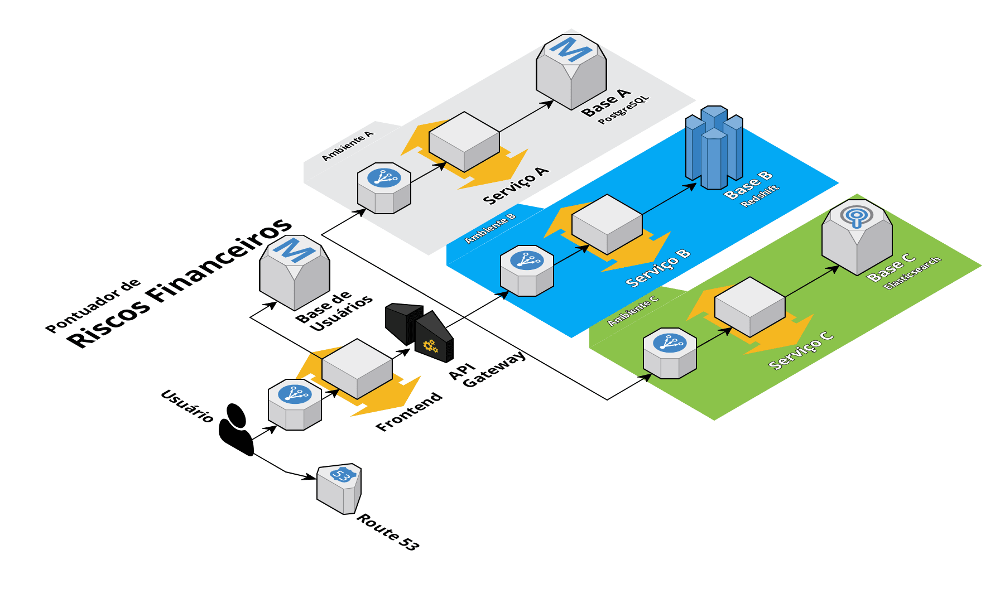

# Pontuador de Riscos Financeiros

Arquitetura de um sistema para análise de riscos de operações financeiras, com base no perfil de um consumidor.

---

## __Arquitetura da Solução__




### __Serviço A__
O primeiro serviço armazena informações sensíveis de uma pessoa, uma API realiza os acessos a um banco de dados protegido e consulta informações por CPF.

Esse serviço retorna a seguinte estrutura de dados:

- CPF
- Nome
- Endereço
- Lista de dívidas:
  - Data de inclusão da dívida na lista
  - Valor devido
  - Entidade que incluiu a dívida na lista


### __Serviço B__
O segundo serviço armazena outras informações sobre uma pessoa para calcular uma pontuação de risco de crédito, realizando acessos a um banco de dados com alta performance e provendo uma API simples para consulta da pontuação por CPF.

Esse serviço retorna a seguinte estrutura de dados:

- CPF
- Pontuação
- Descrição da pontuação

Para calcular esse score, o serviço analisa diversas informações sobre o CPF:

- Idade
- Endereço
- Lista de bens e ativos:
  - Valor
  - Data de aquisição
  - Tipo de bem/ativo
- Lista de fontes de renda:
  - Valor
  - Data da inclusão da fonte
  - Tipo de renda


### __Serviço C__
O terceiro serviço registra informações de eventos financeiros para um CPF, a API pode ser construída com funções Lambda que reduzirão o custo de operação mantendo o desempenho, o serviço provê uma API para consultas de informações rápidas:

- Data das consultas do CPF em um escritório de crédito
- Datas de pagamentos realizados
- Datas de compras com cartão de crédito
- Datas de outras transações financeiras

### __Frontend__
Para o usuário final ficará disponível uma aplicação que consome os serviços anteriores via API, a aplicação é protegida por usuário e senha e possui perfis de acesso:

- __Perfil de Pessoa Física Simples__: Consegue visualizar em uma página a pontuação e a lista de dívidas do seu CPF
- __Perfil de Pessoa Física Com Assinatura__: Consegue visualizar os dados do seu CPF e também consegue consultar as operações realizadas com o seu CPF
- __Perfil de Pessoa Jurídica__: Consegue consultar em uma página a pontuação de um CPF

---

## __Execução da aplicação e testes__

> Para executar a aplicação tenha o [Docker](https://www.docker.com/) e o [Docker Compose](https://docs.docker.com/compose/) instalados em seu computador

A aplicação utiliza dados fictícios, simulando um gateway de API para os serviços A, B e C, é possível utilizar serviços reais atualizando as variávies de ambiente, veja abaixo as variáveis disponíveis:


| __Variável__         | __Descrição__                             |
| -------------------- | ----------------------------------------- |
| `SERVICE_A_ENDPOINT` | URL para a API do serviço A               |
| `SERVICE_B_ENDPOINT` | URL para a API do serviço B               |
| `SERVICE_C_ENDPOINT` | URL para a API do serviço C               |
| `USER_DATABASE_URL`  | URL para conexão com a tabela de usuários |
| `SERVER_ADDRESS`     | Endereço para escuta do servidor          |
| `SERVER_PORT`        | Porta para escuta do servidor             |
| `DEBUG_MODE`         | Se `True` ativa o modo de depuração       |

Para executar a aplicação, utilize o comando abaixo:
```bash
> docker-compose up
```

Para executar os testes da aplicação, utilize o seguinte comando:
```bash
> docker-compose exec api pytest
> docker-compose exec front pytest
```